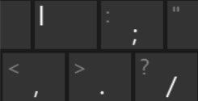

# NYCU-ICG-Final
The final project for Introduction of Computer Graphic in NYCU

## 如何執行
### Requirements
- G++
- CMake
- VS Code (with CMake Tools extension)

### How to run
- Clone this repo (with `--recursive` to clone submodule as well)
    ```bash
    git clone --recursive https://github.com/Sean20405/NYCU-ICG-Final
    ```
- Using VS Code to open the folder
- Setting Compiler in VS Code
- Press the Run button in the bottom left corner in VS Code

## 操作
### 技能
| 按鍵 | 效果 |
| :-: | --- |
| Q | 鬼靈精怪！（切換武器） |
| W | 咻咻！（發射衝擊波） |
| E | 咬咬手榴彈！（投擲手榴彈） |
| R | 超威能死亡火箭！（釋放火箭炮） |
| A | 普攻（會根據當前武器射出不同子彈） |

### 動畫
| 按鍵 | 效果 |
| :-: | --- |
| T | 子彈時間 |
| space | 暫停所有動作 |

### 視角
| 按鍵 | 效果 |
| :-: | --- |
| up | 視角向上旋轉 |
| down | 視角向下旋轉 |
| left | 視角向左旋轉 |
| right | 視角向右旋轉 |
| comma `,` | 視角向左平移 |
| slash `/` | 視角向右平移 |
| L | 視角向前平移 |
| period `.` | 視角向後平移 |
| P | 將視角恢復到初始位置 |

### 鍵盤對應
| 按鍵 | 位置 |
| :-: | --- |
| l , . / |  |